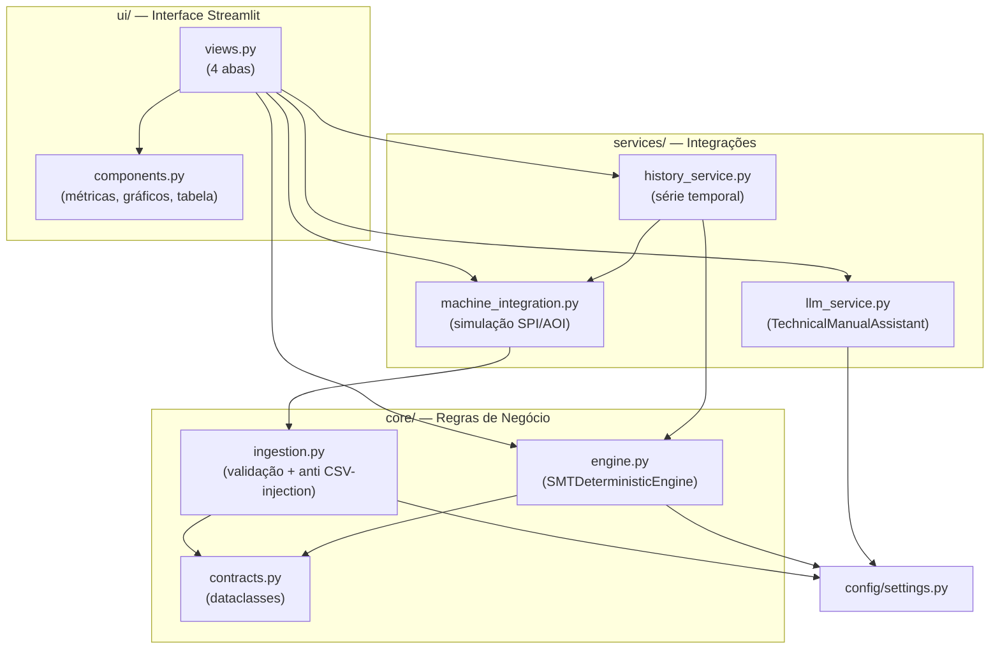

# Sistema de Análise de Causa Raiz para Defeitos em Linhas SMT (SPI & AOI)

[](https://github.com/Kasaharany/service_smt_ia/actions/workflows/ci.yml)

Sistema desenvolvido para diagnóstico automatizado e rastreamento de defeitos no processo de manufatura de montagem em superfície (SMT). A solução integra e correlaciona dados de inspeção de pasta de solda (**SPI**) e inspeção óptica automatizada (**AOI**), reduzindo o tempo de análise de causa raiz e mitigando retrabalhos em ambiente de produção industrial.

---

## 🎯 Objetivo

Eliminar a análise manual reativa de falhas correlacionando desvios volumétricos/geométricos na impressão de solda (SPI) com os defeitos funcionais e estruturais detectados após o forno de refusão (AOI). O sistema gera diagnósticos determinísticos e reprodutíveis para ajustes imediatos na linha.

## ⚙️ Arquitetura e Funcionamento

1. **Ingestão de Dados:** Upload dos relatórios brutos de SPI e AOI (CSV), com validação de esquema (colunas obrigatórias) e normalização de tipos.
2. **Correlação Espacial & Paramétrica:** Mapeamento componente a componente por meio de identificadores de placa (`Panel_Barcode`) e referência de componente (`RefDes`), via junção relacional em memória.
3. **Mapeamento de Causa Raiz (Motor Determinístico):** Regras fixas e auditáveis que identificam se a falha no AOI (ex.: ponte, tombamento, deslocamento) decorreu de anomalias no SPI (ex.: volume excessivo, insuficiência de pasta) — sem depender de um modelo de IA generativa, garantindo reprodutibilidade e severidade classificada (Crítica/Alta/Média/Baixa).
4. **Assistência Técnica Contextual:** Chat opcional apoiado por IA generativa (Google Gemini), que analisa manuais técnicos (PDF) inteiramente em memória volátil — sem persistência em disco — e desacoplado da decisão de causa raiz.
5. **Visualização:** Dashboard Streamlit com métricas operacionais, gráfico de distribuição de causas por equipamento, tabela detalhada e exportação em CSV.

## 🛠️ Tecnologias Utilizadas

* **Linguagem:** Python 3.11+
* **Processamento e Análise de Dados:** Pandas
* **Interface / Dashboard:** Streamlit
* **Assistente Contextual (opcional):** Google Gemini API (`google-genai`)
* **Configuração:** `python-dotenv`
* **Qualidade:** `pytest` (testes automatizados), `ruff` (lint), `mypy` (checagem de tipos), CI via GitHub Actions

## 🧩 Arquitetura em Camadas



A regra é: `ui/` nunca decide causa raiz, `core/` nunca sabe que existe Streamlit, e `services/` isola tudo que um dia vira integração externa real (máquinas, IA, histórico).

## 📁 Estrutura do Repositório

```text
├── app.py                     # Ponto de entrada da aplicação Streamlit
├── config/
│   ├── __init__.py
│   └── settings.py             # Variáveis de ambiente, limites de volume, contratos de colunas
├── core/
│   ├── __init__.py
│   ├── contracts.py             # Dataclasses: SPIDataRecord, AOIDataRecord, DiagnosticResult
│   ├── engine.py                 # SMTDeterministicEngine: regras de causa raiz e correlação
│   └── ingestion.py              # Validação, normalização e proteção contra CSV/formula injection
├── services/
│   ├── __init__.py
│   ├── machine_integration.py    # Simulação de integração direta com as máquinas SPI/AOI
│   ├── history_service.py         # Simulação de histórico/tendência de produção
│   └── llm_service.py             # TechnicalManualAssistant: consulta a manuais via Gemini
├── ui/
│   ├── __init__.py
│   ├── components.py               # Métricas, gráficos e tabela de diagnóstico
│   └── views.py                     # Abas: diagnóstico, histórico, manuais, metodologia
├── tests/                      # Suíte de testes automatizados (pytest)
├── .github/workflows/ci.yml     # Pipeline de CI: lint + type-check + testes
├── data/                       # Dados brutos de SPI e AOI (ignorados pelo git)
├── .env.example                # Modelo de variáveis de ambiente (GEMINI_API_KEY)
├── requirements.txt             # Dependências de execução
├── requirements-dev.txt          # Dependências de execução + desenvolvimento (testes/lint)
├── pyproject.toml               # Configuração de pytest, ruff e mypy
└── README.md
```

## 🚀 Como Executar

```bash
pip install -r requirements.txt
cp .env.example .env   # preencha GEMINI_API_KEY para habilitar o assistente de manuais
streamlit run app.py
```

## ✅ Testes e Qualidade

```bash
pip install -r requirements-dev.txt

ruff check .                                # lint
mypy                                        # checagem de tipos (core/)
python -m pytest --cov --cov-report=term-missing  # testes + cobertura
```

O pipeline de CI (`.github/workflows/ci.yml`) roda essas três etapas a cada push/PR na branch principal.

**Cobertura de testes por camada** (37 testes):

| Camada | Cobertura | Observação |
|---|---|---|
| `core/` (motor determinístico, ingestão, contratos) | **100%** | Núcleo de regras de negócio — todas as ramificações de decisão testadas |
| `services/machine_integration.py` | **100%** | Geração de dados sintéticos |
| `services/history_service.py` | 90% | |
| `ui/*` e `services/llm_service.py` | 0% | Interface Streamlit e chamada à API Gemini — exigiriam Streamlit `AppTest` e mocking de API externa; ver [Limitações](#-limitações-e-trabalhos-futuros) |

## ⚠️ Limitações e Trabalhos Futuros

* **Dados sintéticos:** os fluxos de integração com máquinas e de histórico de produção usam dados gerados artificialmente para fins de demonstração. O sistema ainda não foi validado com relatórios reais de equipamentos de SPI/AOI de uma linha de produção.
* **Cobertura de testes restrita ao núcleo:** os testes automatizados cobrem 100% da lógica de negócio (`core/`), mas não incluem testes de interface (`ui/`) nem da integração com a API do Gemini (`services/llm_service.py`), que dependem de ferramentas adicionais (Streamlit `AppTest`, mocking de API) fora do escopo atual.
* **Validação com usuários reais:** o sistema não foi utilizado em campo por um engenheiro de processo de linha SMT; a avaliação até o momento é funcional/técnica, não um estudo de caso operacional.
* **Integração com máquinas:** o botão de conexão simula, mas não implementa, um conector real (pasta de rede/SFTP ou protocolo SECS/GEM) — ver seção de Metodologia no aplicativo.
